# 🔋 Smart Battery Swap Station -  EV Battery Stations Management System

> A comprehensive solution for booking battery swaps, tracking real-time battery status, and automating charging station operations.

---

## 📘 Introduction

The **Smart Battery Swap Station** project was executed as part of the **SWP391 – Software Development Project** course.
It applies the entire **Software Development Life Cycle (SDLC)** to a realistic simulation project, ranging from requirement gathering, analysis, and system design to deployment, testing, and reporting.

**Key Skills Acquired:**
- Writing **user stories**, analyzing user requirements.
- System design, workflow modeling.
- Software development using **MVC**, **OOP** patterns.
- Designing business flows, handling real-world logic.
- Functional testing and quality optimization.
- Leveraging AI support for collaborative learning and quality enhancement.

This project provided a clearer perspective on teamwork, task distribution, API–Database–UI interaction, and operating a real-time system in a corporate-style environment.

---

## ❗ Problems & ✔️ Solutions

### ❗ Problems
- Long waiting times for charging.
- Uncertainty about which stations have available batteries.
- Manual battery swapping processes are prone to errors.
- Inability to track battery status (SoH / faults).

### ✔️ Solutions
- Online battery swap booking.
- Quick QR Check-in at stations.
- Real-time battery inventory management.
- Automated inspection & evaluation of returned batteries.

---

## 🔄 Workflow

---

### 1️⃣ Registration & Login (User Auth)
- Register Account → Verify Email → Login → Access Dashboard.
- Supports Google OAuth login.
- Forgot password feature via email.

---

### 2️⃣ Vehicle Registration & Linking
- Enter vehicle info → Validate validity/ownership → Display details → Link to account.
- View vehicle list or unlink vehicles as needed.

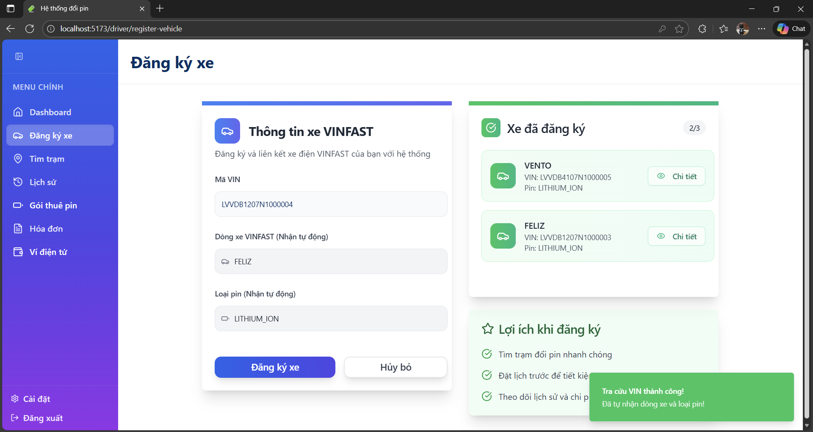
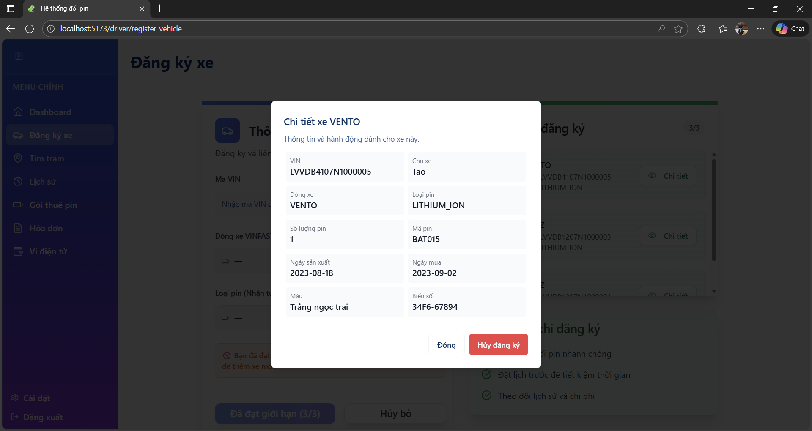

---

### 3️⃣ Top-up & Subscription (Payment)
- Top-up via VNPay → Add to wallet balance.
- (Optional) Select 1 of 3 monthly plans → Pay via wallet.

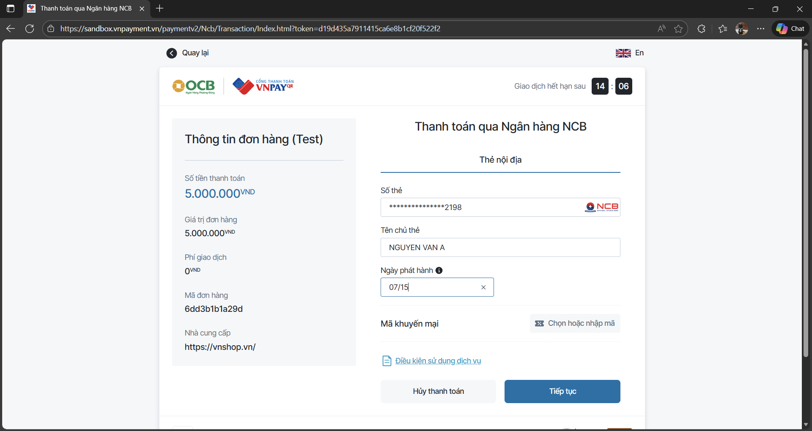
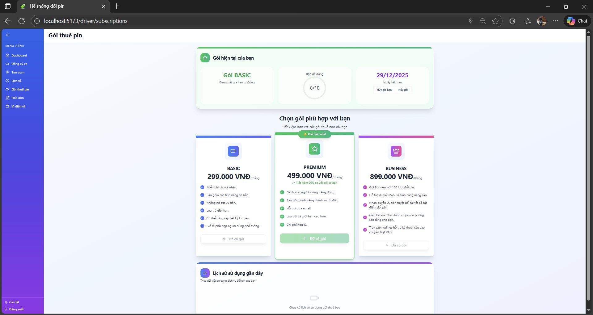

---

### 4️⃣ Find Station & Booking Process
- Auto-detect GPS or manual selection on the map.
- Display stations within a 50km radius + number of available batteries.
- Select vehicle → Select station → Schedule time → Pay via wallet or auto-deduct from subscription (if active).

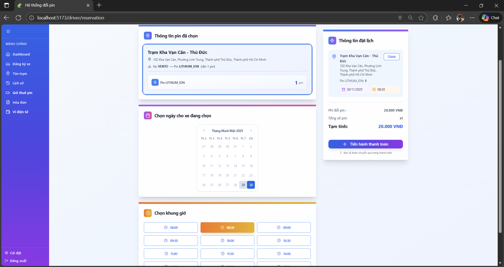
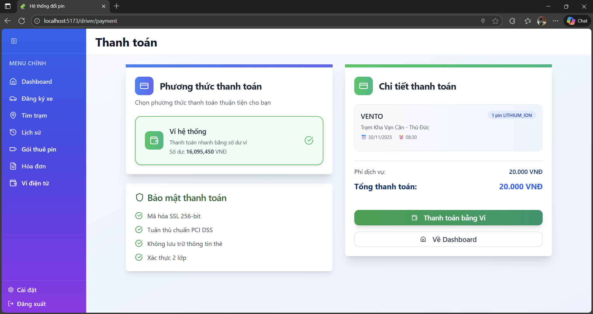
**Payment via Subscription (if registered):**
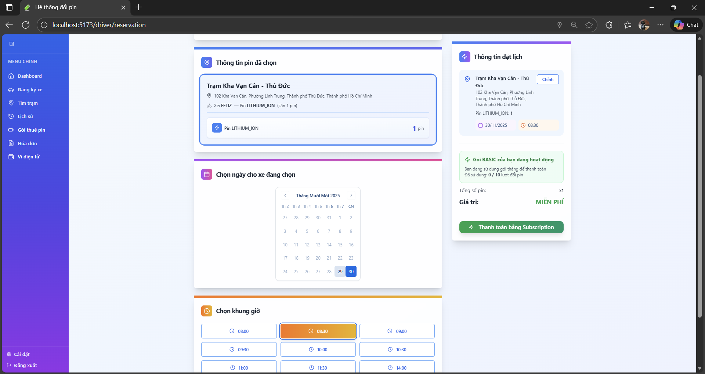

---

### 5️⃣ Swap Operation at Station
- Staff scans Booking QR to check-in.
- Input Customer's BatteryID → System checks validity.
- **If battery is faulty:**
  - Create a dispute ticket.
  - Or cancel the booking.
- **If valid:** → Proceed with swap.
- Returned battery is classified and placed in the appropriate dock.

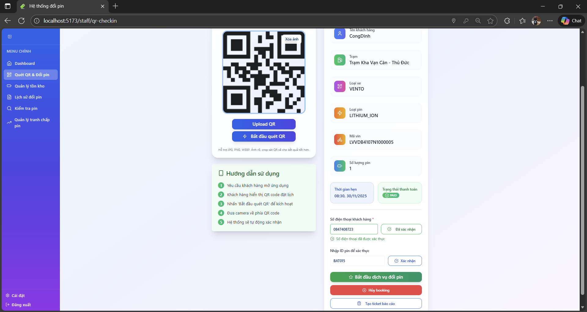
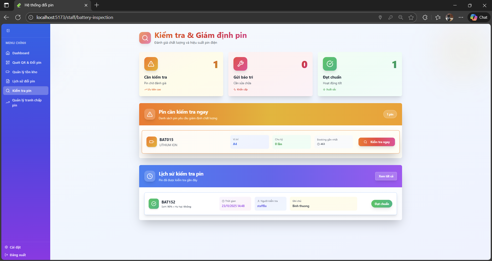
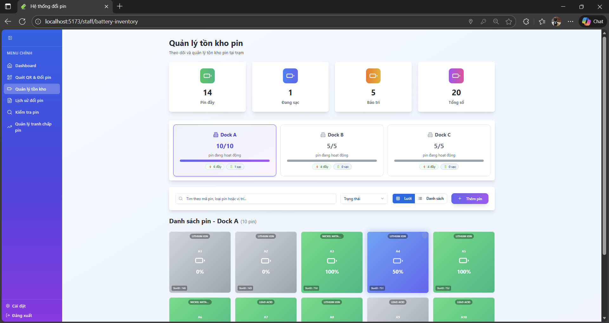
**Dispute Ticket Resolution (if any):**
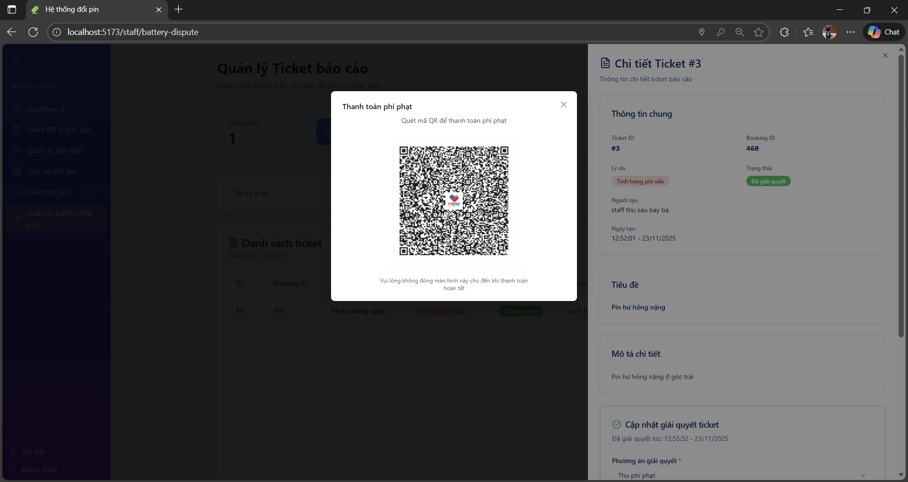

---
## 🛡️ Admin Management System

A dedicated portal for administrators to oversee the entire system, from revenue and personnel to battery inventory operations.

### 1. General Reports
Provides detailed reports on revenue, transactions, and managed battery inventory. The interface features visualization charts for swap frequency and revenue trends over time, with capabilities to export data for external analysis .

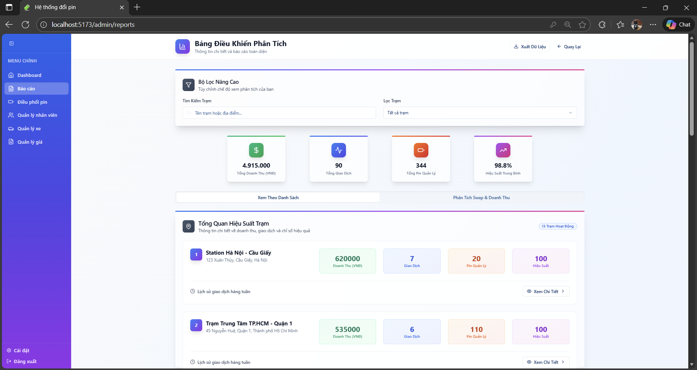

### 2. AI Smart Battery Dispatch
Monitors detailed battery inventory by type at each station. The system displays dispatch orders for updates and lists AI-driven suggestions to apply optimal dispatch commands effectively .

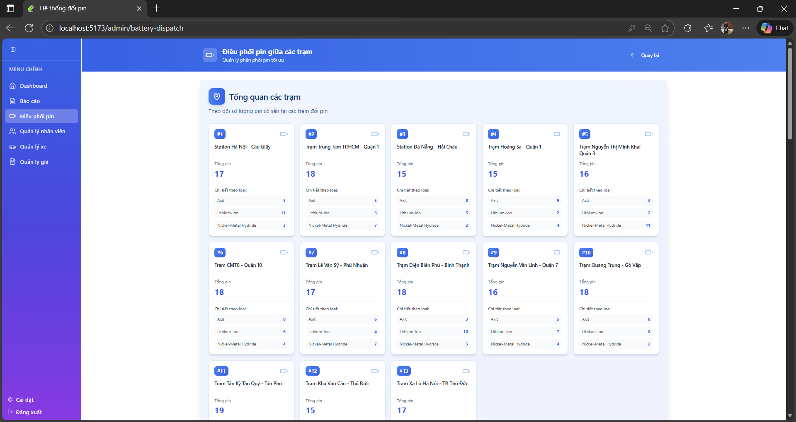
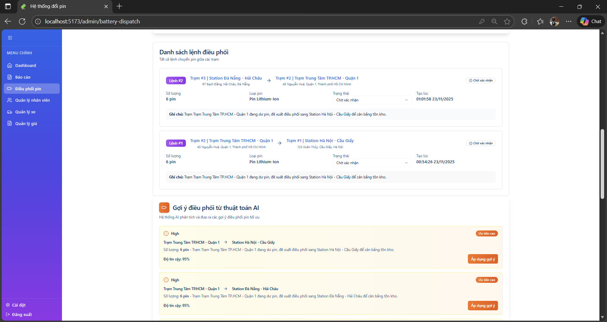

### 3. Staff Management
Manages staff distribution per station. Admins can view the staff count for each location and perform actions to assign available staff or unassign active staff within specific stations .

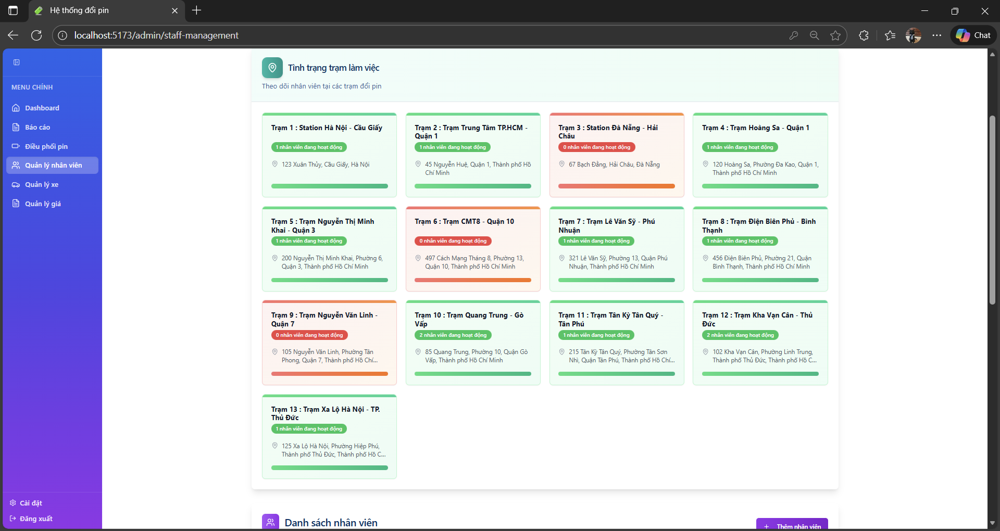
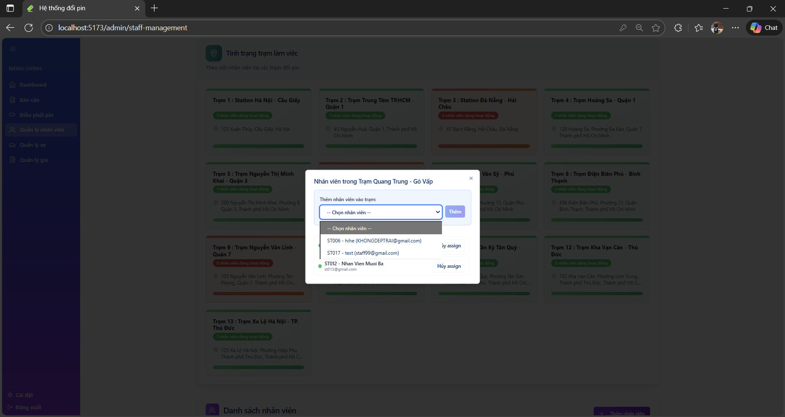
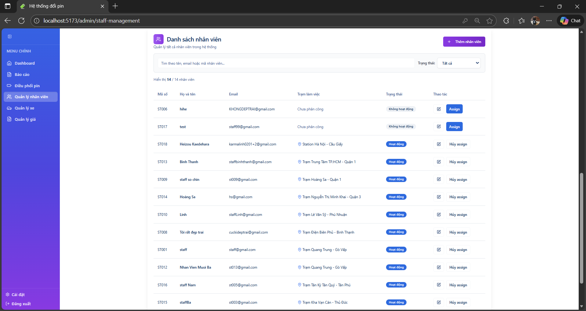

### 4. Vehicle Management
Manages the registry of vehicles with detailed information. Includes a feature to import vehicle lists via CSV from partners to update the system database, complete with import instructions .

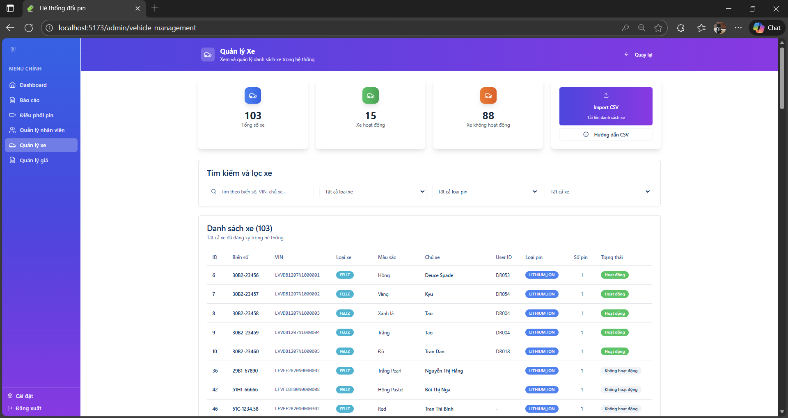
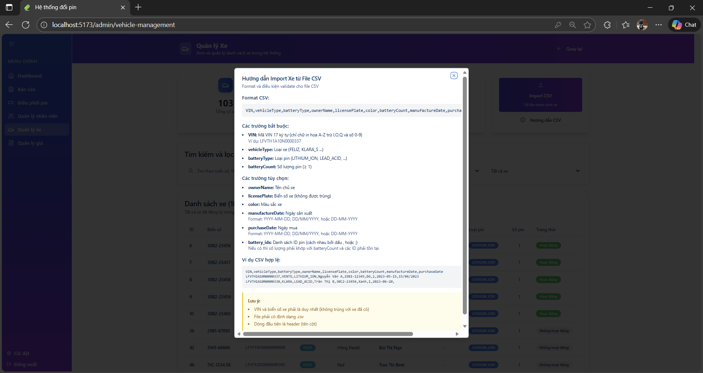

### 5. Pricing Management
CRUD capabilities for managing system pricing and service fees.

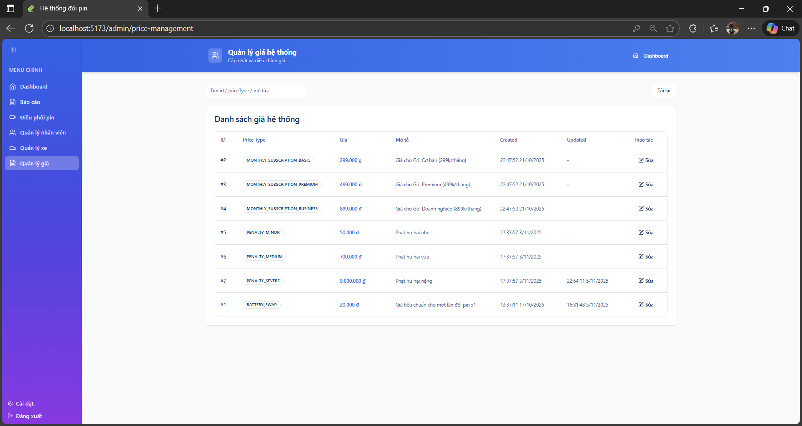
## 🚀 Detailed Features

### 👤 For Drivers
- Register / Login / Link vehicle.
- Find stations using Goong Map.
- Book swaps, pay via wallet or subscription.
- View Battery %, SoH, transaction history.

### 👨‍🔧 For Staff
- Scan Booking QR & process swap flows.
- Real-time dock monitoring.
- Handle faulty batteries and create tickets.
- Record and process violation penalties.

### 🛠 For Admin
- Real-time statistical dashboard.
- Manage stations, battery distribution between stations.
- Manage users, staff, vehicles, and batteries.

---

## 💻 Tech Stack

| Category | Technology |
|--------|-----------|
| **Front-End** | ReactJS, Ant Design, Axios, Toastify, TailWindCss, WebSocket |
| **Back-End** | Spring Boot, Spring Security, JPA |
| **Database** | PostgreSQL |
| **Payments** | VNPay |
| **Maps** | Goong Map API |
| **Auth** | Google OAuth |
| **Deploy** | Railway |

---

## 👥 Development Team

- **Phạm Công Định** — Front-end
- **Nguyễn Đan Huy** — Front-end
- **Phùng Quang Tuyết Linh** — Back-end
- **Nguyễn Huỳnh Minh Phát** — Back-end

>Documented by Công Định